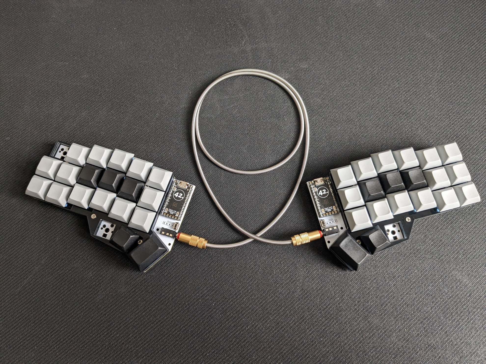

# `sotte` keyboard layouts

This repo contains my keyboard layouts.
(It is a qmk_userspace repo, see [README_qmk_userspace.md](README_qmk_userspace.md) for details.)

## Corne with colemak layout


See [assets/](assets/) for more images.

I use colemak with some modifications.
The layout is inspired by miryoku, getreuer, callum, seniply, and others.
See references below.

### Hardware

Corne V3 hotswap with Frood RP2040 V8 MCU, akko ocean blue switches, and random keycaps.
I got the board from [here](https://42keebs.eu/shop/kits/pro-micro-based/corne-cherry-v3-hotswap-split-ergo-40-kit/).

### TODO: add all layouts

Right now I only have the `sotte` layout.
not the other variations.

<!-- REPLACE_MARKER_START -->
### TL;DR: Features

- 4 layers: `ALPHA` (colemak), `NAV`, `SYM`, `NUM`.
- Only uses 4 thumb keys.
- Callum style one-shot modifiers for most modifiers,.
  but especially useful for the modifiers on he home row in the `NAV` layer.
  `⌥⌘⌃⇧` or alt/gui/ctrl/shift or AGSC.
- [CAPS WORD](https://docs.qmk.fm/#/feature_caps_word) when tapping shift twice.
- [Repeat key](https://docs.qmk.fm/#/feature_repeat_key) on right pinky bottom row
- Different characters on some shifted keys: `,?`, `.!`, `_-`, and `:;`.
- Copy, Cut, Paste keys (via `NAV` layer) that work in and outside of terminals.
- [Layer lock](https://getreuer.info/posts/keyboards/layer-lock/index.html) for `SYM`, `NUM`, and `NAV` layers via the right pinky (top row).

### Thumb cluster and layers

There are 4 layers and you use two thumb switches to select them.

```text
ALPHA: ...  ...
NAV:   ...  .■.
SYM:   .■.  ...
NUM:   .■.  .■.
```

### Legend for special keys

- `•`: noop
- `␣N`: Space on tab, NAV layer on hold
- `♦.`: Repeat last key (or combo)
- `♦9`: NUM layer on press
- `♦A`: Application (context menu)
- `♦L`: Toggle layer lock
- `♦S`: SYM layer on press
- `♦T`: Ctrl-t / my tmux prefix
- `♦c`: Copy (works in and outside of terminals)
- `♦v`: Paste (works in and outside of terminals)
- `♦x`: Cut (works in and outside of terminals)
- `♦⇧`: SHIFT one shot
- `♦⌃`: CTRL one shot
- `♦⌘`: GUI one shot
- `♦⌥`: ALT one shot

### ALPHA layer

```text
ES qQ wW fF pP gG       jJ lL uU yY :; ⌫
♦⌃ aA rR sS tT dD       hH nN eE iI oO ↵
♦⇧ zZ xX cC vV bB       kK mM ,? .! _- ♦.
            •  ␣N ES  ♦⇧ ♦S •
```

This is almost a standard colemak layout.
It contains different non-alpha characters (and different shifted versions)
as the shifted versions are more common ([ref](https://getreuer.info/posts/keyboards/symbol-layer/index.html#symbol-character-frequencies))
and useful than the original ones:

### NAV layer

```text
ES ⌃q ⌃w ⌃f ♦T •        ↥  ⌫  ↑  ⌦  ⌦  ⌫♦L
⌃  ♦⌥ ♦⌘ ♦⌃ ♦⇧ ⌃d       ⇤  ←  ↓  →  ⇥  ↵
⇧  •  ♦x ♦c ♦v •        ↧  ↵  ⭾  ♦3 ♦A ♦.
            •  ■  ES ♦⇧ ♦9 •
```

A fairly simple nav layer.

Note: you can use AGCS on the left side to create complex arrow movements/selections
and delete behavior.
AGCS are callum style one-shot keys and can be used on other layers as well.

### SYMBOL layer

```text
ES .  /  *  #  |        \  '  [  ]  :  ♦L
⌃  !  -  +  =  ~        ^  "  (  )  $  ↵
⇧  ,  <  >  %  &        @  `  {  }  _  ♦.
            •  ␣9 ES ♦⇧ ■  •
```

Inspired by [getreuer](https://getreuer.info/posts/keyboards/symbol-layer/index.html)
and adjusted slightly.

- `^$` mirror `HOME` and `END` on the `NAV` layer and are useful for vim movements.
- Additional `.,` just because they are handy.
- The location of `./` is handy for navigating directories.
- ``' ` "`` in one column to ease memoization.

### NUM layer

```text
ES .  /  *  #  |        .  7  8  9  :  ♦L
⌃  !  -  +  =  ~        0  4  5  6  0  ↵
⇧  ,  <  >  %  &        ,  1  2  3  _  ♦.
            •  ■  •  •  ■  •
```

The right side is the real `NUM` layer.
The left side mirrors the keys from the `SYM` layer which are quite useful for entering formulas.

Issues:

- `()` are not as easy to use as I would like.

### Symbols legend

```text
■ pressed thumb key
• noop
↵ enter
⌫ backspace
⌦ del
⭾ tab
↥↧ page up/down
⇤⇥ home/end
←↑↓→ arrows
⌥⌘⇧⌃ alt/gui/shift/ctrl also AGSC
␣ space
ES ESC
Cc Ctrl+c, Cv Ctrl+v
♦1 special feature 1; explained in the doc
```

<!-- REPLACE_MARKER_END -->

## Usage

```bash
make compile
make flash

# helper to update the readme from the source code
# this is called automatically via make
./bin/update_readme.py
```

## Bootstrap

This repo is a userspace qmk repo.
I build it via docker with the
[new](https://github.com/qmk/qmk_firmware/issues/23984) docker userspace feature.

```bash
# setup qmk
mkdir -p ~/coding/
cd ~/coding/
git clone git@github.com:qmk/qmk_firmware.git
cd qmk_firmware
python3.11 -m venv .venv
source .venv/bin/activate.fish
pip install qmk

# configure userspace
qmk config user.overlay_dir=~/projects/sotte_qmk_keyboard_layout

# make sure everything looks good and there are no warnings
qmk userspace-doctor

# build the layout you want
cd ~/coding/qmk_firmware/
source .venv/bin/activate.fish

bash util/docker_build.sh crkbd:sotte
bash util/docker_build.sh crkbd:sotte_callum
bash util/docker_build.sh crkbd:sotte_seniply_like
bash util/docker_build.sh crkbd:sotte_simple
bash util/docker_build.sh crkbd:sotte_simple_hrm
```

## References

- [Miryoku](https://github.com/manna-harbour/miryoku)
- [seniply](https://stevep99.github.io/seniply/)
- [callum](https://keymapdb.com/keymaps/callum_oakley/)
- [Designing a symbol layer](https://getreuer.info/posts/keyboards/symbol-layer/index.html)
- <https://getreuer.info/posts/keyboards/custom-shift-keys/index.html>
- <https://getreuer.info/posts/keyboards/achordion/index.html>
